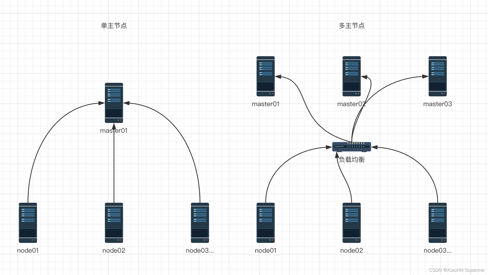

### K8S介绍

- Kubernetes（简称 K8s）是一个由 Google 在 2014 年开源的容器编排平台，用来自动化部署、扩展和管理容器化应用。它提供服务发现、负载均衡、存储编排、自动伸缩和自愈能力，是现代云原生架构的核心基础设施。
- Kubernetes（K8s）在资源调度方面具备强大的能力，能够对 CPU、内存等通用资源 进行精细化分配，同时通过 设备插件机制 支持 GPU
  等专用硬件 的调度与管理，从而满足大规模分布式应用和 AI 计算的需求。

### K8S架构图

### 核心目的

- 离线搭建k8s集群
- 使用k8s对gpu进行调度
- 使用k8s完成大模型的私有化部署（ollama、vLLM）
- 通过k8s的namespace区分不同环境
- 通过k8s搭建监控相关组件

### 安装步骤

#### 单master集群与多master集群拓扑图

#### 单master安装涉及到的服务器及配置明细

| 主机名     | IP地址         | CPU核数 | 内存大小 | 系统盘  | 数据盘   | 系统版本     | 用途说明     |
|---------|--------------|-------|------|------|-------|----------|----------|
| master1 | 55.192.0.125 | 2     | 8GB  | 40GB | 500GB | RHEL 8.9 | K8s 控制节点 |
| node1   | 55.192.0.7   | 2     | 8GB  | 40GB | 500GB | RHEL 8.9 | K8s 工作节点 |
| node2   | 55.192.0.159 | 2     | 8GB  | 40GB | 500GB | RHEL 8.9 | K8s 工作节点 |
| gpu1    | 55.192.0.225 | 16    | 64GB | 40GB | 500GB | RHEL 8.9 | GPU 工作节点 |

#### 多master安装涉及到的服务器及配置明细

- master节点至少3个，建议为奇数

| 主机名     | IP地址         | CPU核数 | 内存大小 | 系统盘  | 数据盘   | 系统版本     | 用途说明             |
|---------|--------------|-------|------|------|-------|----------|------------------|
| master1 | 55.192.0.125 | 2     | 8GB  | 40GB | 500GB | RHEL 8.9 | K8s 控制节点         |
| master2 | 55.192.0.7   | 2     | 8GB  | 40GB | 500GB | RHEL 8.9 | K8s 控制节点         |
| master3 | 55.192.0.159 | 2     | 8GB  | 40GB | 500GB | RHEL 8.9 | K8s 控制节点         |
| --      | 55.192.0.1   | --    | --   | --   | --    | --       | 虚拟IP，负载均衡的虚拟IP地址 |
| gpu1    | 55.192.0.225 | 16    | 64GB | 40GB | 500GB | RHEL 8.9 | GPU 工作节点         |

#### 高可用负载均衡器安装（可选，如已有负载均衡器请忽略）

-

官方建议的负载均衡器选择：https://github.com/kubernetes/kubeadm/blob/main/docs/ha-considerations.md#keepalived-and-haproxy

- 使用keepalived + haproxy搭建负载均衡器最好是单独一个集群，此处为了节省服务器，选择在master1和master2节点上做负载均衡集群，其中keepalived的虚拟IP地址为55.192.0.1

#### 安装
~~~ 
# 安装keepalived + haproxy
rpm -ivh root/yum/lb/*.rpm
# 备份原有配置文件
mv /etc/keepalived/keepalived.conf /etc/keepalived/keepalived.conf.bak
# 创建新的配置文件 /etc/keepalived/keepalived.conf
# 内容如下，按需调整内容：
~~~ 
~~~ 
! Configuration File for keepalived
global_defs {
    router_id LVS_DEVEL
}
vrrp_script check_apiserver {
  script "/etc/keepalived/check_apiserver.sh"
  interval 3
  weight -2
  fall 10
  rise 2
}

vrrp_instance VI_1 {
    # 状态，主节点为MASTER，从节点为BACKUP
    state BACKUP
    # 修改为你自己网卡的名字
    interface ens0
    virtual_router_id 51
    # MASTER当中使用101，BACKUP当中使用100
    priority 100
    authentication {
        auth_type PASS
        # 设置好你的密码，keepalived集群当中需要保证这个值的一致
        auth_pass k8s
    }
    virtual_ipaddress {
        # 注意这里修改为你自己的虚拟IP地址
        55.192.0.1
    }
    track_script {
        check_apiserver
    }
    # 当 VIP 漂移到本机时，主动发送 ARP 广播
    notify_master "/usr/sbin/arping -c 3 -I ens0 55.192.0.1"
    notify_backup "/usr/sbin/arping -c 3 -I ens0 55.192.0.1"
    notify_fault "/usr/sbin/arping -c 3 -I ens0 55.192.0.1"
}
~~~    
~~~
## 编写探活脚本
vi /etc/keepalived/check_apiserver.sh
## 内容如下：
#!/bin/sh

errorExit() {
    echo "*** $*" 1>&2
    exit 1
}

curl --silent --max-time 2 --insecure https://localhost:6553/ -o /dev/null || errorExit "Error GET https://localhost:6553/"
if ip addr | grep -q 55.192.0.99; then
    curl --silent --max-time 2 --insecure https://55.192.0.99:6553/ -o /dev/null || errorExit "Error GET https://55.192.0.99:6553/"
fi
~~~
~~~
# 授权
chmod +x /etc/keepalived/check_apiserver.sh
## 修改haproxy的配置文件 /etc/haproxy/haproxy.cfg
## 内容如下：
#---------------------------------------------------------------------
# Global settings
#---------------------------------------------------------------------
global
    log /dev/log local0
    log /dev/log local1 notice
    daemon

#---------------------------------------------------------------------
# common defaults that all the 'listen' and 'backend' sections will
# use if not designated in their block
#---------------------------------------------------------------------
defaults
    mode                    http
    log                     global
    option                  httplog
    option                  dontlognull
    option http-server-close
    option forwardfor       except 127.0.0.0/8
    option                  redispatch
    retries                 1
    timeout http-request    10s
    timeout queue           20s
    timeout connect         5s
    timeout client          20s
    timeout server          20s
    timeout http-keep-alive 10s
    timeout check           10s

#---------------------------------------------------------------------
# apiserver frontend which proxys to the control plane nodes
#---------------------------------------------------------------------
frontend apiserver
    # 注意负载均衡的端口要与keepalived里面的配置保持一致
    bind *:6553
    mode tcp
    option tcplog
    default_backend apiserver

#---------------------------------------------------------------------
# round robin balancing for apiserver
#---------------------------------------------------------------------
backend apiserver
    option httpchk GET /healthz
    http-check expect status 200
    mode tcp
    option ssl-hello-chk
    balance     roundrobin
        # k8s多个主节点直接拼接到后面即可
        server master1 55.192.0.125:6443 check
        server master2 55.192.0.7:6443 check
        server master3 55.192.0.159:6443 check
~~~
~~~
# 启动keepalived和haproxy
systemctl enable --now keepalived
systemctl enable --now haproxy
systemctl restart keepalived.service 
systemctl restart haproxy

# 查看虚拟IP状态
ip addr
~~~

#### 安装软件明细

| 软件名                          | 版本      | 官方文档                                                                                                    | 介绍                                                                                                           |
|------------------------------|---------|---------------------------------------------------------------------------------------------------------|--------------------------------------------------------------------------------------------------------------|
| k8s(kubeadm\kubelet\kubectl) | v1.34.3 | https://v1-34.docs.kubernetes.io/zh-cn/docs/setup/production-environment/tools/kubeadm/install-kubeadm/ | kubeadm 用来建集群，kubelet 管理节点上的 Pod，kubectl 是和集群沟通的入口。                                                          |
| containerd                   | 1.6.32  | https://github.com/containerd/containerd/blob/main/docs/getting-started.md                              | 在 K8s 中，containerd 就是负责容器的运行时管理，承担镜像拉取、容器生命周期和资源隔离等核心功能，是 kubelet 与容器之间的桥梁。                                  |
| helm                         | v3.14.4 | https://helm.sh/zh/docs/intro/install/                                                                  | Helm 是 Kubernetes 的 包管理器，类似于 Linux 的 apt/yum 或 Python 的 pip。它通过 Chart（应用模板包）来简化应用的安装、升级和回滚，是管理 K8s 应用的核心工具之一 |

#### (所有机器执行)K8S安装

    ## ！！！！！！安装前准备：上传安装脚本以及物料压缩包至相同目录！！！！！！

    ## 给所有机器设定hostname
    hostnamectl set-hostname master1
    hostnamectl set-hostname master2
    hostnamectl set-hostname master3
    hostnamectl set-hostname gpu1

    ## 给所有机器设定hosts
    vim /etc/hosts
    55.192.0.125 master1
    55.192.0.7 master2
    55.192.0.159 master3
    55.192.0.225 gpu1
    55.192.0.24 gpu2

    # 脚本权限 
    chmod 777 init-config.sh
    # 执行脚本
    ./init-config.sh

    # 执行无报错正常结束后，可通过以下方式进行验证，验证通过后，即可开始后续流程
    ## 确认containerd安装完成
    containerd --version

    ## 确认k8s工具安装完成
    kubeadm version
    kubelet --version
    kubectl version --client

    ## 确认helm工具安装完成
    helm version

#### (仅GPU节点) 安装 nvidia-container-runtime

    # 安装nvidia-container-runtime
    rpm -ivh /data/k8s/yum-repo/yum/container-runtime-toolkit/*.rpm    

    # 创建配置
    sudo nvidia-ctk runtime configure --runtime=containerd
    # 修改配置 vim /etc/containerd/conf.d/99-nvidia.toml 
    default_runtime_name = "nvidia"
    # 重启
    sudo systemctl restart containerd

### 初始化K8S集群

#### (仅master执行)Master节点初始化

    # 在主节点执行初始化操作 control-plane-endpoint=55.192.0.1:6553 填写负载均衡的地址
    sudo kubeadm init --control-plane-endpoint "55.192.0.1:6553" --upload-certs

    # 完成后执行以下命令
    mkdir -p $HOME/.kube
    sudo cp -i /etc/kubernetes/admin.conf $HOME/.kube/config
    sudo chown $(id -u):$(id -g) $HOME/.kube/config

    # 验证（此时状态为NotReady，安装后续的网络插件后，会变成Ready状态）
    kubectl get node

    # 添加其余两台master
    kubeadm join 55.192.0.1:6553 --token o5w3av.b8q93vby3x1s4fh7 --discovery-token-ca-cert-hash sha256:cfe5bb6654ee06277718b2fbf0f580c446f2b8fbbb315db02cab82177b09d521  --control-plane

#### (仅node执行)添加Node节点

    # 在Master节点执行以下命令，获取到加入集群的指令
    sudo kubeadm token create --print-join-command

    # 将输出的指令，在需要加入集群的Node节点上执行
    kubeadm join 55.192.0.159:6443 --token prsjur.lnaih6vr385ez1of --discovery-token-ca-cert-hash sha256:16a7e60868d8a017de61e32e7aa45adf46343befd14d21fed3fe316999c66b1e 
    
    # 执行完成后，在Master节点查看节点状态
    kubectl get node

#### K8S插件明细

插件清单：https://v1-34.docs.kubernetes.io/zh-cn/docs/concepts/cluster-administration/addons/#networking-and-network-policy

| 插件名                  | 版本       | 官方文档                                                                                     | yaml\helm repo                                                                            |                                                                                                        |
|----------------------|----------|------------------------------------------------------------------------------------------|-------------------------------------------------------------------------------------------|--------------------------------------------------------------------------------------------------------|
| Calico               | v3.27.0  | https://docs.tigera.io/calico/latest/getting-started/kubernetes/quickstart               | yaml https://raw.githubusercontent.com/projectcalico/calico/v3.27.0/manifests/calico.yaml | Calico 是 Kubernetes 中最常用的 网络与安全插件，以 纯三层（L3）路由架构 和 BGP 分发 为核心，提供高性能的 Pod 网络通信和强大的网络策略控制，被广泛应用于企业级集群。    |
| kubernetes-dashboard | 7.14.0   | https://kubernetes.io/zh-cn/docs/tasks/access-application-cluster/web-ui-dashboard/      | helm https://kubernetes.github.io/dashboard/                                              | Kubernetes Dashboard 是一个 基于 Web 的用户界面（UI），用于管理和监控 Kubernetes 集群。它让用户无需依赖命令行工具（kubectl），就能直观地查看和操作集群资源。 |
| GPU Operator         | v25.10.1 | https://docs.nvidia.com/datacenter/cloud-native/gpu-operator/latest/getting-started.html | helm https://helm.ngc.nvidia.com/nvidia                                                   | GPU Operator 就像 Kubernetes 的“GPU 管家”，负责驱动安装、工具链配置和监控，让 GPU 在集群中开箱即用，极大简化了 AI 工作负载的部署。                  |

#### (仅master执行)安装K8S组件

    # 执行安装脚本
    chmod 777 master-k8s-component.sh
    ./master-k8s-component.sh

    ## 检查node状态是否都Ready
    kubectl get node

    # 检查dashboard是否都正常RUNNING
    kubectl get pod -n kubernetes-dashboard

    ## 检查POD是否都正常RUNNING 
    kubectl get pod -n kube-system

    ## 检查gpu-operator是否都正常RUNNING
    kubectl get pod -n gpu-operator

#### (仅master执行)登录kubernetes-dashboard

    # 暴露服务,将ClusterIP修改为NodePort
    kubectl edit service kubernetes-dashboard-kong-proxy -n kubernetes-dashboard

    # 检查POD是否都正常RUNNING
    kubectl get pod -n kubernetes-dashboard
    
    # 查看service端口
    kubectl get service -n kubernetes-dashboard

    # 浏览器访问 dashboard （k8s集群内任意IP均可访问，端口号查看上一条命令返回的端口号）
    https://55.192.0.159:30135/#/login

    # 创建用户
    kubectl apply -f /data/k8s/yaml/user-service.yaml
    kubectl apply -f /data/k8s/yaml/user.yaml

    # 生成token
    kubectl -n kubernetes-dashboard create token admin-user

    # 使用token登录dashboard

#### （master执行）GPU调度验证

    ## 运行验证POD
    kubectl apply -f /data/k8s/yaml/gpu-test.yaml

    ## 查看POD状态,Completed表示成功
    kubectl get pod | grep gpu-test-pod

    ## 查看POD日志，正常输出GPU情况表示成功
    kubectl logs gpu-test-pod
    
    ## 清理
    kubectl delete -f /data/k8s/yaml/gpu-test.yaml

#### 监控相关 grafana、prometheus

    helm repo add prometheus-community https://prometheus-community.github.io/helm-charts
    helm repo update

    kubectl create ns monitoring
    helm install monitoring prometheus-community/kube-prometheus-stack -n monitoring

    # 查看密码
    kubectl get secret monitoring-grafana -n monitoring -o jsonpath="{.data.admin-password}" | base64 --decode

    # GRAFANA端口暴露，type改为：NodePort
    kubectl edit service monitoring-grafana -n monitoring

### 演示Case

#### DASHBOARD
- 

#### GRAFANA

- http://55.192.0.225:30724/
- admin/test

#### 安装Ollama，并运行大模型（GPU调度），将服务暴露出来供业务开发方使用

    # 解压ollama离线镜像，其它版本可以去docker仓库下载，https://hub.docker.com/r/ollama/ollama
    ctr -n k8s.io images import ollama.tar

    # 部署
    kubectl apply -f /data/k8s/yaml/ollama.yaml

    # 查看运行状态
    kubectl get pod

    # 查看服务端口
    kubectl get service | grep ollama

    # 访问，集群任意IP+端口
    curl http://55.192.0.225:31434/

    # 验证是否用到GPU 查看进程
    ollama ps

#### 安装vLLM，并运行大模型（GPU调度），将服务暴露出来供业务开发方使用

#### 安装Dify，并调用到自建的大模型，将服务暴露出来供业务开发方使用

    

