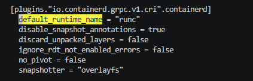

### 单Master K8S集群安装

#### 单master安装涉及到的服务器及配置明细

| 主机名     | IP地址         | CPU核数 | 内存大小 | 系统盘  | 数据盘   | 系统版本     | 用途说明                |
|---------|--------------|-------|------|------|-------|----------|---------------------|
| master1 | 55.192.0.125 | 2     | 8GB  | 40GB | 500GB | RHEL 8.9 | K8s 控制节点            |
| node1   | 55.192.0.7   | 2     | 8GB  | 40GB | 500GB | RHEL 8.9 | K8s 工作节点            |
| node2   | 55.192.0.159 | 2     | 8GB  | 40GB | 500GB | RHEL 8.9 | K8s 工作节点            |
| gpu1    | 55.192.0.225 | 16    | 64GB | 40GB | 500GB | RHEL 8.9 | GPU 工作节点,已安装完成GPU驱动 |

#### 安装软件明细

| 软件名                       | 版本    | 官方文档                                                     | 介绍                                                         |
| ---------------------------- | ------- | ------------------------------------------------------------ | ------------------------------------------------------------ |
| k8s(kubeadm\kubelet\kubectl) | v1.34.3 | https://v1-34.docs.kubernetes.io/zh-cn/docs/setup/production-environment/tools/kubeadm/install-kubeadm/ | kubeadm 用来建集群，kubelet 管理节点上的 Pod，kubectl 是和集群沟通的入口。 |
| containerd                   | v2.2.1  | https://github.com/containerd/containerd/blob/main/docs/getting-started.md | 在 K8s 中，containerd 就是负责容器的运行时管理，承担镜像拉取、容器生命周期和资源隔离等核心功能，是 kubelet 与容器之间的桥梁。 |
| helm                         | v3.14.4 | https://helm.sh/zh/docs/intro/install/                       | Helm 是 Kubernetes 的 包管理器，类似于 Linux 的 apt/yum 或 Python 的 pip。它通过 Chart（应用模板包）来简化应用的安装、升级和回滚，是管理 K8s 应用的核心工具之一 |

#### K8S安装前说明

部署物料下载地址：https://app-center-9a80a0dd892e4a7085270719d64e89c3.obs.ap-southeast-1.myhuaweicloud.com:443/k8s-cluster.zip?AccessKeyId=HPUA7USXCYBYESN2UX28&Expires=1771040445&Signature=r2NzBgV7wRCvsNXRsBh03X3VMvA%3D

~~~
解压提供的k8s-cluster.zip文件，文件说明如下：
└───k8s-cluster K8S集群部署相关的脚本及涉及到的依赖（安装包，容器镜像等）
    ├───init-config.sh K8S安装脚本
    ├───k8s.tar.gz K8S安装涉及到的依赖包
    └───master-k8s-component.sh K8S组件部署脚本

在进行安装前，需要把目录k8s-cluster.zip上传至K8S集群所有机器内，并解压缩

# 解压缩
unzip k8s-cluster.zip
# 进入目录
cd k8s-cluster
~~~

#### (所有机器执行)K8S安装

~~~
## ！！！！！！安装前准备：上传安装脚本以及物料压缩包至相同目录！！！！！！

## 给所有机器设定hostname
55.192.0.125执行：hostnamectl set-hostname master1
55.192.0.7执行：  hostnamectl set-hostname node1
55.192.0.159执行：hostnamectl set-hostname node2
55.192.0.225执行：hostnamectl set-hostname gpu1

## 给所有机器设定hosts
cat >> /etc/hosts <<EOF
55.192.0.125 master1
55.192.0.7 node1
55.192.0.159 node2
55.192.0.225 gpu1
EOF

# 脚本权限 
chmod 777 init-config.sh
# 执行脚本
./init-config.sh

# 执行无报错正常结束后，可通过以下方式进行验证，验证通过后，即可开始后续流程
## 确认containerd安装完成
containerd --version

## 确认k8s工具安装完成
kubeadm version
kubelet --version
kubectl version --client

## 确认helm工具安装完成
helm version
~~~

### 初始化K8S集群

#### (仅master执行)Master节点初始化

~~~
# 在主节点执行初始化操作 control-plane-endpoint=55.192.0.1:6553 填写负载均衡的地址
sudo kubeadm init --control-plane-endpoint "55.192.0.125" --upload-certs

# 完成后执行以下命令
mkdir -p $HOME/.kube
sudo cp -i /etc/kubernetes/admin.conf $HOME/.kube/config
sudo chown $(id -u):$(id -g) $HOME/.kube/config

# 验证（此时状态为NotReady，安装后续的网络插件后，会变成Ready状态）
kubectl get node
~~~

#### (仅node执行)添加Node节点

~~~
# 在Master节点执行以下命令，获取到加入集群的指令
sudo kubeadm token create --print-join-command

# 将输出的指令，在需要加入集群的Node节点上执行
kubeadm join 55.192.0.159:6443 --token prsjur.lnaih6vr385ez1of --discovery-token-ca-cert-hash sha256:16a7e60868d8a017de61e32e7aa45adf46343befd14d21fed3fe316999c66b1e 

# 执行完成后，在Master节点查看节点状态
kubectl get node
~~~

#### K8S插件明细

K8S官方插件清单：https://v1-34.docs.kubernetes.io/zh-cn/docs/concepts/cluster-administration/addons/#networking-and-network-policy

| 插件名                  | 版本       | 官方文档                                                                                     | yaml\helm repo                                                                            |                                                                                                        |
|----------------------|----------|------------------------------------------------------------------------------------------|-------------------------------------------------------------------------------------------|--------------------------------------------------------------------------------------------------------|
| Calico               | v3.27.0  | https://docs.tigera.io/calico/latest/getting-started/kubernetes/quickstart               | yaml https://raw.githubusercontent.com/projectcalico/calico/v3.27.0/manifests/calico.yaml | Calico 是 Kubernetes 中最常用的 网络与安全插件，以 纯三层（L3）路由架构 和 BGP 分发 为核心，提供高性能的 Pod 网络通信和强大的网络策略控制，被广泛应用于企业级集群。    |
| kubernetes-dashboard | 7.14.0   | https://kubernetes.io/zh-cn/docs/tasks/access-application-cluster/web-ui-dashboard/      | helm https://kubernetes.github.io/dashboard/                                              | Kubernetes Dashboard 是一个 基于 Web 的用户界面（UI），用于管理和监控 Kubernetes 集群。它让用户无需依赖命令行工具（kubectl），就能直观地查看和操作集群资源。 |
| GPU Operator         | v25.10.1 | https://docs.nvidia.com/datacenter/cloud-native/gpu-operator/latest/getting-started.html | helm https://helm.ngc.nvidia.com/nvidia                                                   | GPU Operator 就像 Kubernetes 的“GPU 管家”，负责驱动安装、工具链配置和监控，让 GPU 在集群中开箱即用，极大简化了 AI 工作负载的部署。                  |

#### (仅master执行)安装K8S组件

~~~
# 执行安装脚本
chmod 777 master-k8s-component.sh
./master-k8s-component.sh

## 检查node状态是否都Ready
kubectl get node

# 检查dashboard是否都正常RUNNING
kubectl get pod -n kubernetes-dashboard

## 检查POD是否都正常RUNNING 
kubectl get pod -n kube-system

## 检查gpu-operator是否都正常RUNNING
kubectl get pod -n gpu-operator
~~~

#### (仅master执行)登录kubernetes-dashboard

~~~
# 暴露服务,将type: ClusterIP修改为type: NodePort
kubectl edit service kubernetes-dashboard-kong-proxy -n kubernetes-dashboard

# 检查POD是否都正常RUNNING
kubectl get pod -n kubernetes-dashboard

# 查看service端口
kubectl get service -n kubernetes-dashboard | grep kubernetes-dashboard-kong-proxy

# 浏览器访问 dashboard （k8s集群内任意IP均可访问，端口号查看上一条命令返回的端口号）
https://55.192.0.159:30135/#/login

# 创建用户
kubectl apply -f /data/k8s/yaml/user-service.yaml
kubectl apply -f /data/k8s/yaml/user.yaml

# 生成token
kubectl -n kubernetes-dashboard create token admin-user --duration 999999h

# 使用token登录dashboard
~~~

#### (仅GPU节点) 安装 nvidia-container-runtime

- GPU节点需要预先安装好GPU驱动，如未安装驱动，请先安装好驱动

~~~
# 安装nvidia-container-runtime
rpm -ivh /data/k8s/yum-repo/yum/container-runtime-toolkit/*.rpm    

# 创建配置
sudo nvidia-ctk runtime configure --runtime=containerd
# 修改配置，将 default_runtime_name = “runc" 修改为：default_runtime_name = “nvidia"
vim /etc/containerd/conf.d/99-nvidia.toml 
~~~

~~~
# 重启containerd
sudo systemctl restart containerd
~~~

#### （master执行）GPU调度验证

~~~
## 运行验证POD
kubectl apply -f /data/k8s/yaml/gpu-test.yaml

## 查看POD状态,Completed表示成功
kubectl get pod | grep gpu-test-pod

## 查看POD日志，正常输出GPU情况表示成功
kubectl logs gpu-test-pod

## 清理
kubectl delete -f /data/k8s/yaml/gpu-test.yaml
~~~

#### （master执行）创建Namespace用于区分测试环境

~~~
## 创建dev环境Namespace
kubectl create namespace wlb-dev
## 创建sit环境Namespace
kubectl create namespace wlb-sit
## 创建uat环境Namespace
kubectl create namespace wlb-uat
~~~

